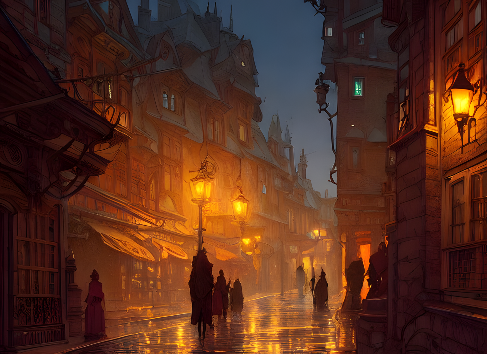
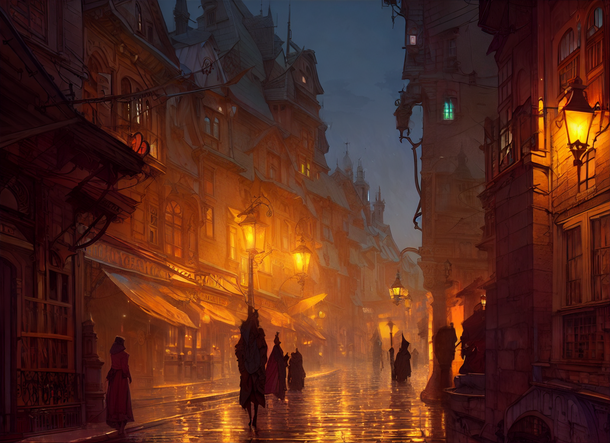

# Stable Diffusion Upscaling

- Pass 0 : 
  * Original
  * 
      
    (704 x 512)
  * Upscaled
    
    (1408 x 1024)
  * Detailed
    
    (1408 x 1024)
- Pass 1 :
  * Upscaled
    
    (2816 x 2048)
  * Detailed
    
    (2816 x 2048)
- Pass 2 : 
  * Upscaled
    
    (5632 x 4096)
